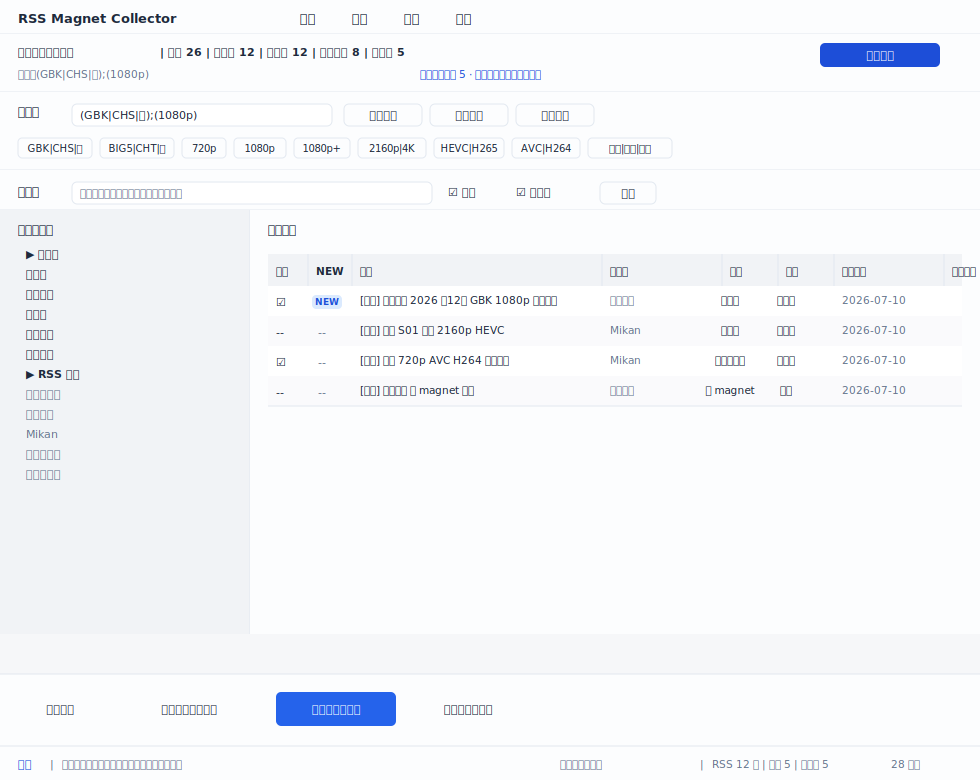
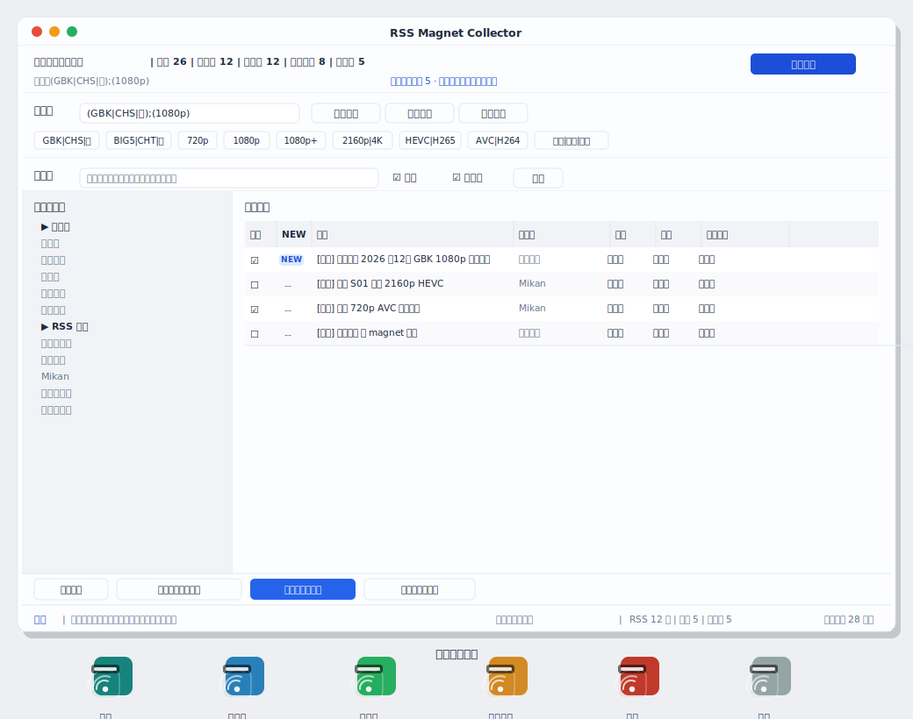

<div align="center">


# RSS Magnet Collector

轻量级 Windows 托盘 RSS 磁力链接收集器

C# / .NET 10 / WinForms · 无数据库 · 便携存储 · 剪贴板导出

</div>

---

## 简介

**RSS Magnet Collector**（程序集名 `RRSMC`）是一个运行在 Windows 上的轻量级后台托盘工具，用于：

- 管理多个 RSS / Atom 订阅地址；
- 按设定间隔自动检查更新；
- 从 RSS 条目中提取 magnet 磁力链接；
- 根据条件、正则表达式、清晰度、语言等规则自动筛选；
- 将符合条件的 magnet 链接复制到剪贴板；
- 用托盘图标实时显示运行状态、网络状态和 RSS 检查状态。

项目不追求复杂数据库、账号系统、远程同步和下载器集成，优先保证：**轻量、简单、便携、后台稳定、复制方便、状态清晰**。整个程序文件夹可以直接复制到另一台电脑即开即用。

> 适用场景：个人自用、追番追剧、按清晰度/语言/编码条件长期订阅收集磁力链接。

---

## 特性总览

| 模块 | 功能 |
|---|---|
| RSS 管理 | 添加、编辑、删除、启用、停用、分组订阅 |
| 定时检查 | 全局检查间隔、单订阅独立间隔、手动立即检查、失败重试退避 |
| 网络诊断 | 判断本机网络、DNS、HTTP 状态、RSS 内容是否有效 |
| RSS 解析 | 兼容 RSS 2.0 / Atom，多字段兜底扫描 magnet |
| magnet 提取 | 从 title / link / guid / description / content:encoded / enclosure 等多字段扫描，按 info hash 去重 |
| torrent 识别 | 找不到 magnet 时识别 torrent 链接；可由可信格式的 torrent URL 本地推导 magnet |
| 条件筛选 | 快捷按钮 + 条件表达式（`;` AND、`|` OR、`!` NOT）+ 自定义正则包含/排除 |
| 勾选导出 | 条目左侧 checkbox，可复制勾选项；活动批次保存到文件，重启可续 |
| 全部导出 | 一键复制全部待导出 / 按当前条件 / 按当前订阅 / 按当前视图 |
| 种子导出 | 保存 RSS 中已有的 .torrent URL 到 data 目录，不下载、不解析种子文件 |
| 剪贴板导出 | 默认复制到剪贴板，一行一个 magnet |
| 托盘状态 | 正常 / 检查中 / 有新增 / 部分失败 / 离线 / 暂停 |
| 提醒 | 新增提醒、失败提醒、汇总提醒（气泡通知） |
| 便携存储 | 所有数据放在程序目录 `data/` 文件夹内，不依赖数据库 |
| Mikan 兼容 | 兼容类似 Mikan 的 RSS；可补抓公开历史页补充 magnet/torrent |
| 开机自启 | 可选开机自动启动、启动后进入托盘、启动后立即检查全部 |

---

## 主界面布局

主窗口标题为 `RSS Magnet Collector`，采用冷色调石板蓝靛蓝主题（背景 `#F6F7F9`，主色 `#2563EB`），整体布局自上而下如下：

<p align="center">
  
</p>

### 菜单

顶部菜单（实际实现）：

- **订阅**：添加 RSS、编辑选中、删除选中、启用/停用选中、补抓选中 Mikan 历史
- **检查**：立即检查全部订阅、只检查失败订阅
- **导出**：按条件筛选并勾选、复制已勾选磁力、导出已勾选种子、清除当前勾选、取消本次批选、复制全部待导出磁力、全部勾选当前范围、恢复选中暂不导出为待导出、删除选中条目、高级导出（复制当前视图/订阅/条件待导出磁力、重新复制当前条件全部磁力、复制失败诊断）
- **工具**：条件选择、诊断、日志、设置

### 侧边栏

左侧导航分两段：

- **工作区**：未使用、暂时废弃、已使用、异常条目、检查失败
- **RSS 订阅**：按分组列出全部订阅

### 条目网格

右侧表格展示当前范围内的条目，含 checkbox、NEW 标记、标题、清晰度/语言/编码、匹配状态（已提取 / 被规则过滤 / 无 magnet / 仅 torrent / 已导出）。

---

## 条件筛选

### 条件表达式语法

条件栏使用简单规则，避免复杂表达式解析器：

| 符号 | 含义 |
|---|---|
| `;` | AND，多个子句必须同时满足 |
| `|` | OR，同一子句内满足其一即可 |
| `!` | NOT，排除匹配的条目 |
| `(...)` | 分组 |

示例：

```
(GBK|CHS|简);(1080p|2160p|4k);!(720p)
```

含义：标题或字段中包含 GBK / CHS / 简 **之一**，同时包含 1080p / 2160p / 4K **之一**，且排除 720p。

点击快捷按钮会按 `;` 追加为新的 `(子句)`，而不是替换原条件。

### 默认快捷按钮

界面默认提供 9 个快捷按钮（来自 `FilterQuickOption.All`）：

| 按钮 | 展开子句 |
|---|---|
| `GBK|CHS|简` | `GBK|CHS|简` |
| `BIG5|CHT|繁` | `BIG5|CHT|繁` |
| `720p` | `720p` |
| `1080p` | `1080p` |
| `1080p+` | `1080p|1080i|1440p|2160p|4k|uhd` |
| `2160p|4K` | `2160p|4k|uhd` |
| `HEVC|H265` | `HEVC|H265` |
| `AVC|H264` | `AVC|H264` |
| `字幕|内嵌|外挂` | `字幕|内嵌|外挂` |

### 条件选择面板

点击 `条件选择` 弹出完整面板，可勾选语言/清晰度/编码自动生成表达式，或手写自定义包含/排除正则，并保存为预设。

### 常用正则示例

```regex
(?i)(GBK|CHS|简|简体|SC)            # 简体
(?i)(BIG5|CHT|繁|繁体|TC)           # 繁体
(?i)\b1080p\b                       # 只要 1080p
(?i)(\b1080p\b|\b2160p\b|\b4k\b)    # 1080p 及以上
(?i)\b720p\b                        # 排除 720p（放进排除条件）
```

---

## 本地数据结构

所有数据都存放在程序所在目录的 `data/` 文件夹内，不依赖任何数据库，便于备份与迁移。

```
程序目录/
├─ RRSMC.exe
├─ data/
│  ├─ app.settings.json      # 全局设置
│  ├─ feeds.json             # RSS 订阅列表
│  ├─ rules.json             # 条件筛选与正则规则
│  ├─ feed_state.json        # 每个订阅的最后检查状态
│  ├─ item_cache.jsonl       # 已发现条目缓存（一行一个 JSON）
│  ├─ export_history.jsonl   # 已复制/已导出记录
│  ├─ active_batch.json      # 当前活动批选批次
│  ├─ torrent_exports/       # 种子导出目录（按时间戳子目录）
│  └─ logs/
│     ├─ app.log
│     └─ error.log
```

### 条目状态

每条 `MagnetItem` 同时记录两类状态：

- **匹配状态** `matchStatus`：`extracted` / `no_magnet` / `torrent_only` / `filtered` / `exported`
- **处理状态** `processingStatus`：`pending` / `discarded` / `used` / `deleted`

### 批量筛选结算

`按条件筛选并勾选` 会建立一个待结算批次（保存到 `active_batch.json`），符合当前规则的自动勾选，用户可继续手动增减；复制勾选后，已复制的标记为 `used`，批次中未复制的标记为 `discarded`。同一时间只允许一个活动批次，隐藏到托盘或重启后仍可继续结算或取消。

---

## 托盘

### 状态图标

| 状态 | 图标含义 | 悬停提示示例 |
|---|---|---|
| 正常 | 程序正常运行 | 正常｜12 个订阅｜0 个新增 |
| 检查中 | 正在刷新 RSS | 检查中｜已完成 3/12 |
| 有新增 | 发现新 magnet | 有新增｜5 条待复制 |
| 部分失败 | 有订阅检查失败 | 警告｜3 个订阅失败 |
| 离线 | 网络或全部 RSS 不可用 | 离线｜无法连接 RSS |
| 暂停 | 自动检查暂停 | 已暂停｜右键继续监控 |

### 左键点击

如果主窗口隐藏则打开主窗口；已打开则激活到前台；有新增时默认打开对应列表。

### 右键菜单（实际实现）

```
打开主界面
复制全部待导出磁力
复制符合当前条件的待导出项
立即检查全部订阅
只检查失败订阅
暂停 / 继续
─────────
状态（只读）
条件（快捷按钮 + 预设 + 打开条件选择 + 清空）
─────────
设置
打开日志目录
退出
```

---

## 失败原因分类

| 类型 | 提示 |
|---|---|
| 网络失败 | 无法连接网络或目标站点不可达 |
| DNS 失败 | 域名解析失败 |
| HTTPS 失败 | TLS / 证书连接失败 |
| HTTP 异常 | 返回 403 / 404 / 500 等状态码 |
| 非 XML | 返回内容不是 RSS/Atom XML |
| XML 解析失败 | 内容像 XML，但结构异常 |
| 无条目 | RSS 正常，但没有 item/entry |
| 无 magnet | RSS 正常，但没找到 magnet |
| torrent only | 没有 magnet，但发现 torrent 链接 |
| 被条件过滤 | 有 magnet，但不符合当前规则 |

---

## 设置

设置页面包含：

- **基础**：开机自动启动、启动后进入托盘、关闭窗口时最小化到托盘
- **检查**：全局更新间隔（默认 30 分钟）、启动后延迟检查（默认 10 秒）、失败重试间隔（默认 5 分钟）、每个 RSS 请求间隔（默认 2 秒）、每个订阅最大保留文章数（默认 1000）、启动后立即检查全部
- **导出**：复制后标记为已使用（默认开启）、复制后隐藏已导出项（默认关闭）、换行格式（默认 CRLF）
- **规则**：默认条件、管理条件预设
- **缓存**：最大缓存条目（默认 10000）、历史保留天数（默认 90）、清理已导出历史、打开 data 文件夹

### 单订阅间隔

每个 RSS 可单独设置：使用全局间隔 或自定义间隔（分钟）。

---

## 项目结构

```
RSSMagnetCatcher/
├─ App/
│  ├─ Program.cs                 # 入口
│  ├─ AppBootstrapper.cs         # 启动装配链
│  ├─ TrayApplicationContext.cs  # 托盘常驻上下文
│  ├─ TrayIconFactory.cs         # 托盘图标生成
│  └─ IconGenerator.cs           # 状态图标绘制
├─ UI/
│  ├─ MainForm.cs                # 主窗口（菜单/汇总/条件/搜索/侧边栏/表格/动作栏）
│  ├─ SettingsForm.cs            # 设置页
│  ├─ FeedEditForm.cs           # RSS 编辑
│  ├─ RulePickerForm.cs         # 条件选择
│  ├─ RuleManagerForm.cs        # 规则管理
│  ├─ RuleEditForm.cs           # 规则编辑
│  ├─ DiagnosticsForm.cs        # 诊断
│  ├─ LogViewerForm.cs          # 日志查看
│  └─ UiTheme.cs                # 主题色与扁平菜单渲染器
├─ Core/
│  ├─ Models/                    # 数据模型
│  ├─ Services/                  # 业务服务
│  └─ Utils/                     # HashHelper 等
├─ Storage/
│  ├─ DataPaths.cs              # 路径定义
│  ├─ JsonConfigStore.cs         # JSON 配置读写
│  ├─ JsonlItemStore.cs         # JSONL 条目追加
│  ├─ FeedStateStore.cs         # 订阅状态
│  ├─ ExportHistoryStore.cs     # 导出历史
│  ├─ ActiveBatchStore.cs       # 活动批次
│  └─ DataInitializer.cs        # 首次数据初始化
├─ Infrastructure/
│  ├─ Logger.cs                 # 文本日志
│  ├─ StartupManager.cs         # 开机自启
│  └─ PathLauncher.cs           # 打开目录/文件
├─ Resources/
│  ├─ app.ico
│  └─ app.png
├─ RSSMagnetCatcher.Tests/       # 单元测试
├─ RSSMagnetCatcher.csproj
└─ RSSMagnetCatcher.sln
```

### 核心服务

| 服务 | 职责 |
|---|---|
| `FeedScheduler` | 定时检查调度、暂停/继续、失败重试退避 |
| `FeedCheckService` | 单订阅检查：请求 → 解析 → 提取 → 去重 → 规则匹配 → 写缓存 |
| `RssFetchService` / `RssParseService` | RSS 下载与 XML 解析（兼容 RSS 2.0 / Atom） |
| `MagnetExtractService` | 多字段扫描 magnet、提取 info hash、去重 |
| `TorrentMagnetBackfillService` | 由可信格式 torrent URL 本地推导 magnet |
| `RuleMatchService` | 条件表达式解析与匹配（`;` AND、`|` OR、`!` NOT） |
| `RulePresetService` | 规则预设读写 |
| `ItemFilterService` / `ItemListQueryService` | 条目过滤与列表查询 |
| `ItemWorkflowService` | 勾选/批选/标记/恢复/软删除 |
| `ClipboardExportService` | 复制 magnet 到剪贴板 |
| `TorrentExportService` | 保存 .torrent URL 到 data 目录 |
| `CacheMaintenanceService` | 缓存清理、历史过期 |
| `ApplicationStatusService` | 全局状态汇总 |
| `FeedDiagnosticsService` | 网络 / RSS 失败诊断 |
| `MikanHistoryService` | Mikan 公开历史页补抓 |

---

## 技术栈

- **语言 / 运行时**：C# / .NET 10（`net10.0-windows`）
- **界面**：WinForms + `NotifyIcon` 托盘
- **网络**：`HttpClient`
- **解析**：`XDocument` / `XmlReader`，`Regex`
- **存储**：JSON（`System.Text.Json`，camelCase + 缩进）+ JSONL 追加
- **导出**：剪贴板 + .torrent 文件保存
- **日志**：文本日志
- **依赖**：无外部 NuGet 包，零额外依赖
- **输出**：`WinExe`，程序集名 `RRSMC`，产物 `RRSMC.exe`

---

## 构建与运行

需要安装 .NET 10 SDK（Windows）。

```powershell
# 构建
dotnet build RSSMagnetCatcher.csproj -c Debug

# 直接运行
dotnet run --project RSSMagnetCatcher.csproj

# 发布单文件可执行
dotnet publish RSSMagnetCatcher.csproj -c Release -r win-x64 --self-contained false
```

构建产物在 `bin/Debug/net10.0-windows/`（Debug）或 `bin/Release/.../publish/`（发布）下，程序集名为 `RRSMC.exe`。

运行测试：

```powershell
dotnet test RSSMagnetCatcher.Tests/RSSMagnetCatcher.Tests.csproj
```

---

## 使用流程

1. 双击 `RRSMC.exe`，程序进入系统托盘。
2. 右键托盘 → 设置：根据需要开启开机自启、启动后进入托盘等。
3. 通过菜单 订阅 → 添加 RSS，加入你的 RSS/Atom 地址（可分组、设置独立间隔）。
4. 在条件栏用快捷按钮或手写表达式设定筛选条件（例如 `(GBK|CHS|简);(1080p+)`）。
5. 后台会按间隔自动检查；新发现且符合条件的条目自动勾选。
6. 需要时：右键托盘 → 复制符合当前条件的待导出项；或在主界面复制勾选 / 全部待导出。
7. 复制后自动标记为已使用；如需导出 .torrent，使用 导出 → 导出已勾选种子。

---

## 界面预览

> 下图为程序主界面布局示意与实际运行时的高保真呈现。

<p align="center">
  
</p>

<p align="center">
  
</p>

<p align="center">
  
</p>

> 最上为带窗口边框的主界面预览；中图为主界面布局示意；下方为程序托盘 / 任务栏图标（由 `IconGenerator` 生成）。


## 许可证

本项目采用 [Apache License 2.0](LICENSE)。

---

## 说明

- 本仓库的 `RRSMC.md` 是核心开发要求文档，记录了完整的功能与设计规格。
- 本程序仅用于收集和管理 RSS 中公开的 magnet/torrent 链接，不下载、不解析、不集成下载器，也不自动抓取任意网页。
